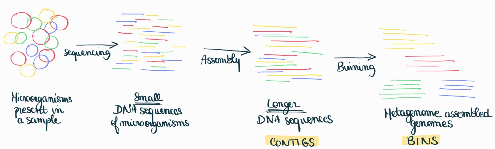
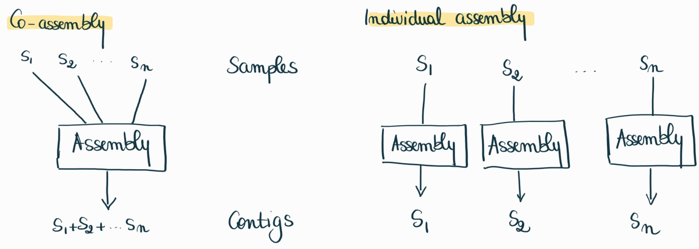
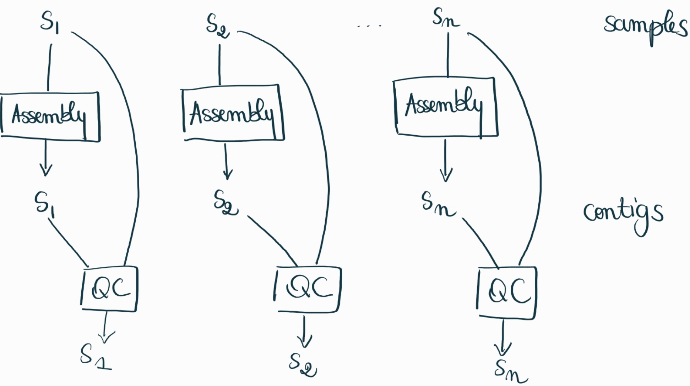
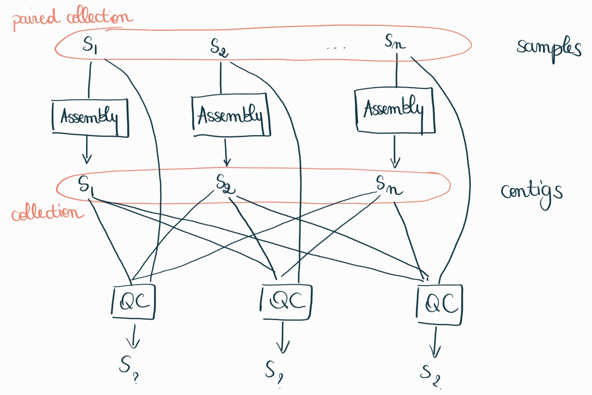
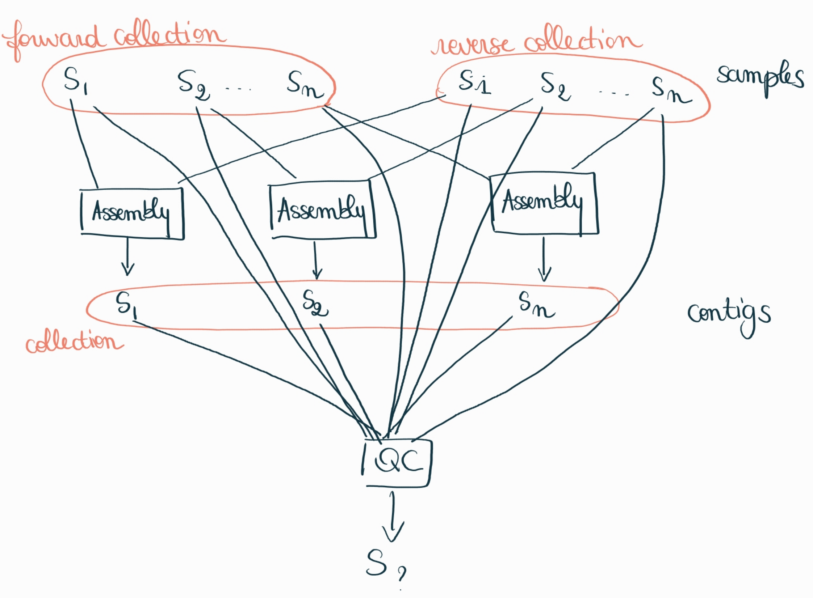

<!-- .slide: data-background="images/index.jpg" data-state="dim-background" -->
## Galaxy collections and assembly
## A nightmare for tool user interface

<br>

Bérénice Batut

<small>University of Freiburg, Germany <br> She/her - <i class="fab fa-twitter"></i> <i class="fab fa-github"></i> [@bebatut](twitter.com/bebatut) - <i class="fas fa-envelope"></i> berenice.batut@gmail.com</small>

<br>

<small>Galaxy Community Call - March 2023</small>


<small style="position: absolute; right: 0%; font-size: 0.2em; bottom: -20%;">Photo by [Ketut Subiyanto](https://www.pexels.com/@ketut-subiyanto/) from [Pexels](https://www.pexels.com/photo/stressed-black-male-entrepreneur-working-on-laptop-in-park-4560092/)</small>


Note:
-

---
### Metagenomics assembly



---
### 2 assembly approaches



---
### The problem

With Galaxy tools and multiple samples as inputs
- Need to explicitely add the 2 modes
- Only co-assembly implemented for many tools

----
### Example for [MetaSpades](https://github.com/galaxyproject/tools-iuc/blob/main/tools/spades/macros.xml)

```
#if $singlePaired.sPaired == "single"
    #for $read in $file_paths1
        --s $library '${read}'
    #end for
#else if  $singlePaired.sPaired == "paired"
    #for $read in $fw_reads1
        --${singlePaired.type_paired}-1 $library '${read}'
    #end for
    #for $read in $rv_reads1
        --${singlePaired.type_paired}-2 $library '${read}'
        --${singlePaired.type_paired}-or $library $singlePaired.orientation
    #end for
#else if $singlePaired.sPaired == "paired_interlaced"
    #for $read in $file_paths1
        --${singlePaired.type_paired}-12 $library '${read}'
        --${singlePaired.type_paired}-or $library $singlePaired.orientation
    #end for
#else
    #for $read in $fw_reads1
        --${singlePaired.type_paired}-1 $library '${read}'
    #end for
    #for $read in $rv_reads1
        --${singlePaired.type_paired}-2 $library '${read}'
        --${singlePaired.type_paired}-or $library $singlePaired.orientation
    #end for
#end if
```

---
### Trickier case - How it should work



----
### Trickier case - Reality



----
### Trickier case - Reality



---
### Current solution

- Identify the cases when it happens
- Modify XML tools of tools to add assembly mode
- Remove the for loops in individual assembly mode
- Tools
    - [ ] MetaSpades
    - [X] MEGAHIT
    - [X] QUAST
    - [X] CheckM
    - [ ] CoverM
    - [X] Semibin
    - Many other tools!!


---
### Is there a better solution???

